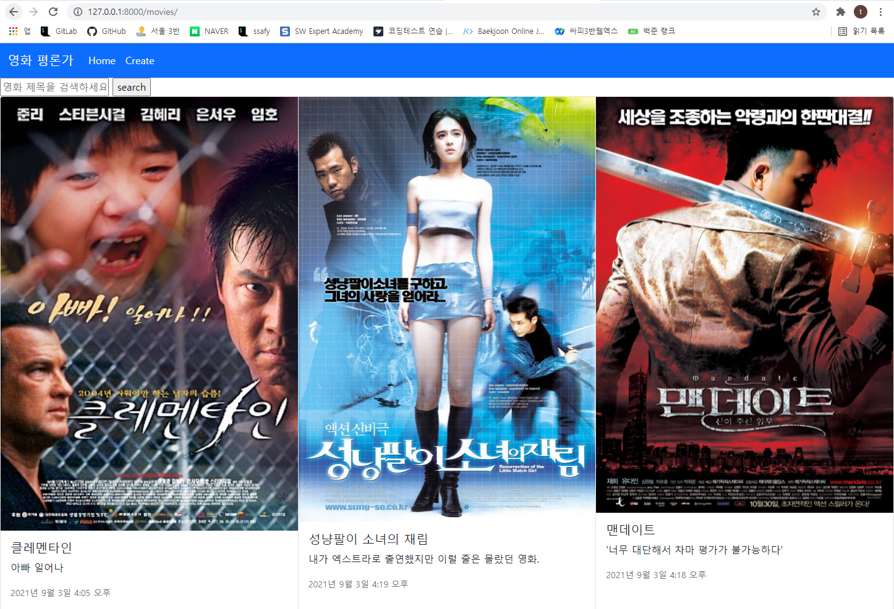
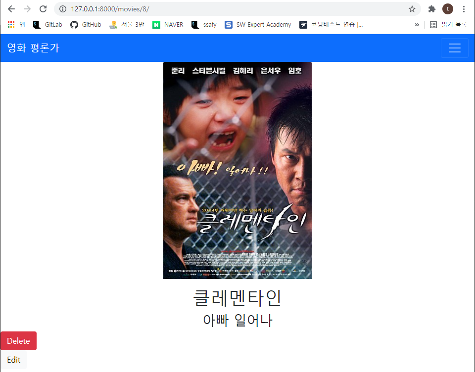
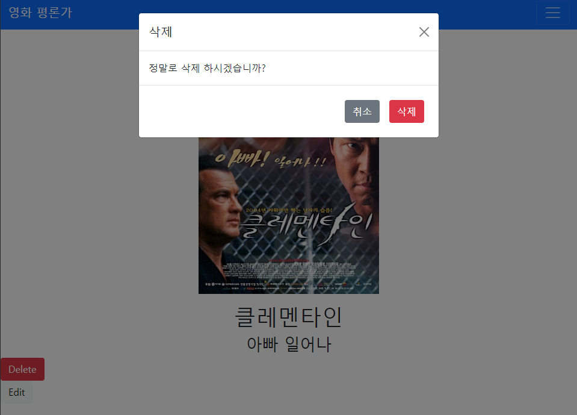
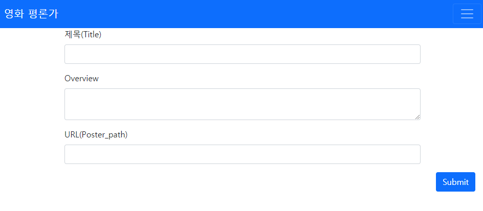
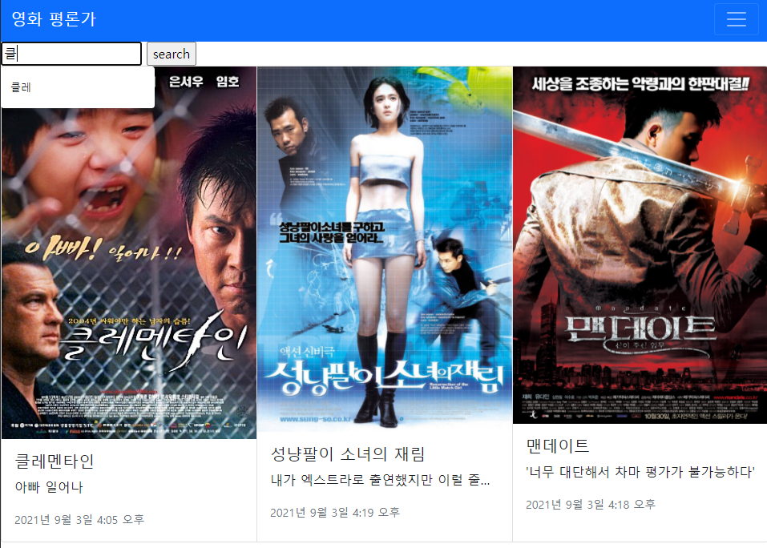
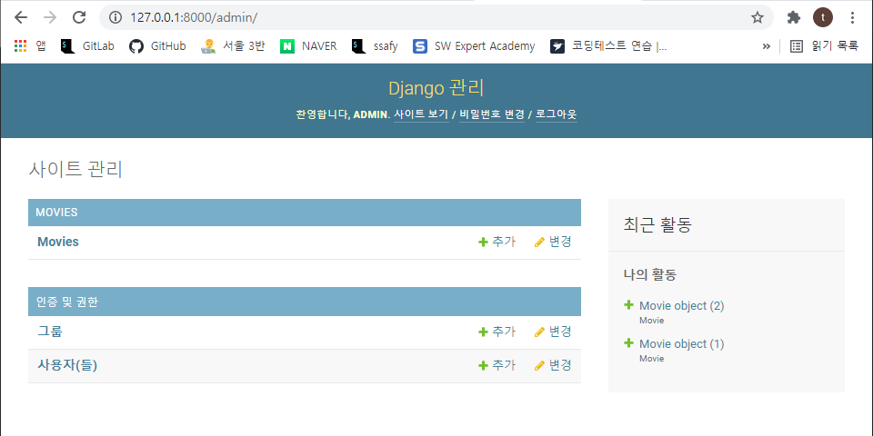

# SSAFY Project 04

###  🎯 구현 내용

- `pjt04` 프로젝트 및 `movies` 앱 생성
- `Movie` 모델 생성 및 마이그레이션
- 관리자 페이지 구현
- 영화정보 CRUD 기능 구현
  - `Create` : 새로운 영화 정보 작성
    - 정보 저장 후 해당 영화 페이지로 redirect
  - `Read` : 전체 영화 목록 조회 및 단일 영화 상세 조회
  - `Update` : 단일 영화 정보 수정 
    - 수정 후 해당 영화 페이지로 redirect
  - `Delete` : 단일 영화 정보 삭제
    - 삭제 버튼 클릭시, 삭제 여부 재확인
    - 삭제 후 전체 영화 목록 페이지로 redirect
- Bootstrap를 이용한 레이아웃 구현
- 전체 영화 목록 조회시, 검색 기능 구현

## Index page (movies)

## detail page (movies/<pk>)

## Delete page (pop up)

## Create page

## 추가 기능 : Search

## Admin page

 

### ✅ 후기

이번 프로젝트가 끝나고 저번(3주 전) 프로젝트 당시를 떠올려보았다...

저번 프로젝트도 역시 3인(혹은 4인) 1팀으로 구성이 되어 있었지만, co-work가 아닌 각자 프로그래밍을 하고 비교나 질문을 공유하는 형식이었다.

이번에는 한명이 운전을 하고 나머지가 네비게이션 역할을 해주는 매우 친절하고 어썸한 방식이었다.

혼자서 맨땅에 헤딩을 하는 것보다 둘이서 머리를 맞대고 무엇이 잘못되었는지, 어떤 코드가 빠졌는지 골똘히 생각하고 고민하다보면 빠르게 결론과 답이 도출되었다. 

이번 프로젝트는 체력적으로 가장 힘들었지만, 심적으로는 가장 편했던(나만 그럴수도 있다)프로젝트였다.

학창시절 조모임이나 그룹 프로젝트에 대한 트라우마가 없고, 즐겁고 행복했던 기억만 있던 나로써는 매우 재미있고 즐거운 하루였다.

p.s. 보노보노상을 위해 보노보노 그림을 집어넣으려 했지만, 내 능력의 한계 때문에 안집어넣었다. 근데 다른조가 집어넣을 것을 보고 다행이란 생각이 들었다

